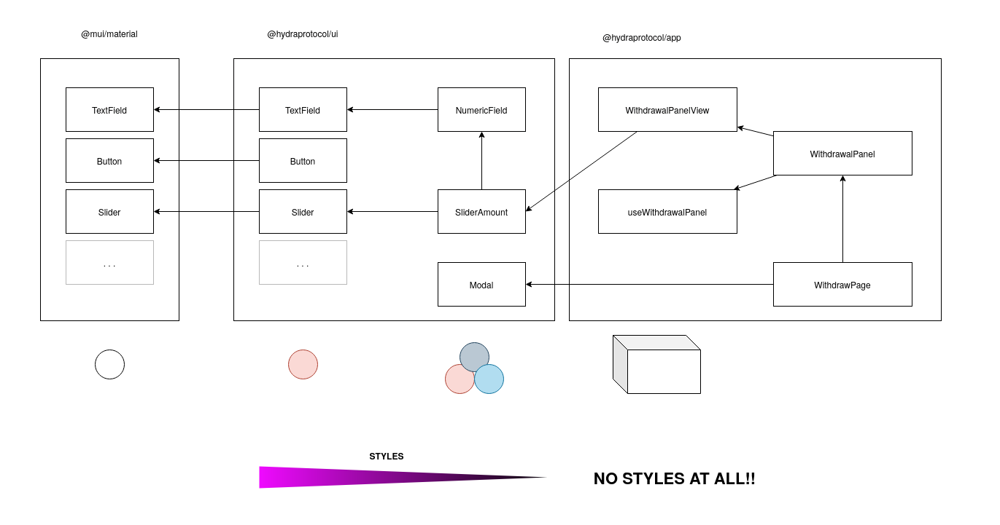
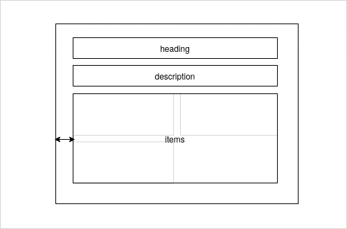

[← 🏠](./CONTRIBUTING.md)

# Clean as you go

⚜️ Boyscouting / Girlscouting

> "as you go"'s & best practices for PRs

We expect developers to clean as they go within their PRs so we can achieve a state of consistency sooner than hitting the repo with a big bang weekend cleanup.

### 🌎 Repo-wide suggestions

The following practices should apply to all PRs to any part of our stack.

#### No feature submission without a passing test

If you add a feature or you edit code that drives a feature you will have to edit test code as the test will either fail or you will need to add a test. If you don't add a test your PR cannot be merged. (Note this is only for production ready feature code).

#### Don't be afraid to commit unfinished work.

You can commit unfinished work. Just be sure you have tests and comments around it, that it compiles and that it does not make it into the compiled bundle. If you are working on a new feature that is not ready for production yet save hook up implementation for a future PR - clearly mark your code as work in progress and create unit tests for your feature (if applicable) so that it will not be built into the deployable bundle. This is preferrable to having diverging/aging branches.

#### Include an issue number in your branch name

Including an issue number in your branch name makes your life easier and allows you to know when you can delete branches.

#### Token Variable Names

In TS references to tokenA and tokenB are unsorted while tokenX and tokenY are sorted by pubkey.

### 🖼️ Frontend `/app` "as you go"s

#### No use of `useStyle` outside of `/app/src/ui`

It has been identified that we currently have some accidental technical debt within our frontend application around style encapsulation. Specifically the use of `useStyle` in large components. Therefore we have implemented the following rule that has only been partially implemented:

> No use of `useStyle` outside of `/app/src/ui`

If you find yourself changing CSS styles for a component outside of `/app/src/ui` as much as is practical you should do the following:

1. Extract the "view" or "dumb" part of the component to an inline component that accepts props for relevant dynamic content such as text or markup.
2. Move that "view" component to `/app/src/ui/{myComponent}`
3. (optional for single use components) Create a storybook story for testing your component.

If you only get `1.` done that is mergable but if you do neither your PR can not be approved.

Here is a diagram of the architecture we want to migrate to:



#### We want to build up a self describing interface language

We should avoid complexity by using encapsulation, inversion of control, along with good naming.

❌ Let's avoid this:

```tsx
// These styles are coupled to the markup and need to be coordinated which makes refactoring difficult
const useStyles = makeStyles({
  swapContainer: {
    // outer wraper styles
  },
  assetContainer: {
    // asset container
  },
  assetDetail: {
    // ...
  },
});

function MyPage() {
  const classes = useStyles();
  const { asset, balances } = usePageData();

  return (
    <Box className={classes.swapContainer}>
      <Box className={classes.assetContainer}>
        <Box>
          <Box className={classes.assetDetail}>
            <Typography>From</Typography>
            <Typography aria-label={`${asset.symbol} inline balance`}>
              Balance: {asset ? balances.get(asset.address) : ""}
            </Typography>
          </Box>
        </Box>
      </Box>
    </Box>
  );
}
```

✔️ In favour of this:

```tsx
// Because styles here are encapsulated within components this markup is much more flexible.
function MyPage() {
  const { asset, balances } = usePageData();

  return (
    <SwapContainer>
      <AssetContainer>
        <AssetRow>
          <AssetDetail label="From" asset={asset} balances={balances} />
        </AssetRow>
      </AssetContainer>
    </SwapContainer>
  );
}
```

#### Separate "containers" from "content"

In interface design an item is either a container or a piece of content or both. Containers are responsible for the layout of their children's content. This generally includes spacing. If you follow this rule all the way down you get a set of maintainable CSS styles. Thinking in terms of reusable general components helps alot when creating a design system.



- Containers control spacing and media queries
- Content controls styling
- Elements can have both roles but they should never stipulate their own margins or padding

#### Default to using `useCallback` for callbacks

There are times when you don't necessarily need to use `useCallback` in React but those are fewer than one might expect. The perf overhead of the function declaration is pretty minimal and using `useCallback` is a good default starting point to avoid performance penalties. Therefore:

- use `useCallback` for handlers unless there is a really good reason not to.
- use `useMemo` for all values shared with hooks that are not primatives to keep them referentially transparent.
- Avoid inline handlers

Don't worry about this within storybook.

### ⚙️ SDK "as you go"s

### ⚓ Solana/Anchor "as you go"s

- All Rust code is formatted using the latest version of `rustfmt`. Use this in your IDE instead of any built in formatters please.

- All Rust code is linted with Clippy. If you'd prefer to ignore its advice, do so explicitly: `rust #[allow(clippy::too_many_arguments)]`

- For variable names, when in doubt, spell it out. The mapping from type names to variable names is to lowercase the type name, putting an underscore before each capital letter. Variable names should not be abbreviated unless being used as closure arguments and the brevity improves readability. This happens in particular when translating maths functions where it makes more sense to use an abbreviated form. When a function has multiple instances of the same type, qualify each with a prefix and underscore (i.e. alice_keypair) or a numeric suffix (i.e. tx0).

- For function and method names, use `<verb>\_<subject>`. For unit tests, that verb should always be `test` and for benchmarks the verb should always be `bench`. Avoid namespacing function names with some arbitrary word. Avoid abbreviating words in function names.
- We have been favouring the [Box type to save stack space](https://docs.rs/anchor-lang/latest/anchor_lang/accounts/boxed/index.html) as a convention on anchor accounts structs. e.g. `pub token_x_vault: Box<Account<'info, TokenAccount>>,` This has some advantages in terms of maintaining smart pointers and not needing explicit account loaders in instructions.
- We should be using `require!` macro instead of more long winded errors e.g.

  ```
  if ctx.accounts.lp_token_mint.supply == 0 {
        return Err(ErrorCode::PoolNotFunded.into());
    }
  ```

becomes

```
require!(ctx.accounts.lp_token_mint.supply > 0, PoolNotFunded);
```

- Anchor constraints should reference our custom error types e.g.

  ```
  #[account(constraint = token_x.to_account_info().key == &pool_state.load()?.token_x_mint @ ErrorCode::InvalidTokenAccount)]
  ```

- CPI calls should be moved to a separate interfaces directory (don’t inline them within instructions directory) to make it clear how cross program calls work. This convention is currently not in force (needs refactoring).

- Builder patter in supporting libs should favour use of `derive_builder` crate more consistently to reduce boiler plate code and increase readability.
- As code has evolved over time with different developers, inconsistencies may arise. If you see an opportunity to suggest a new convention, in the first instance you should mirror existing code but call out the inconsistency in your PR so that we can continue to evolve the code base.
