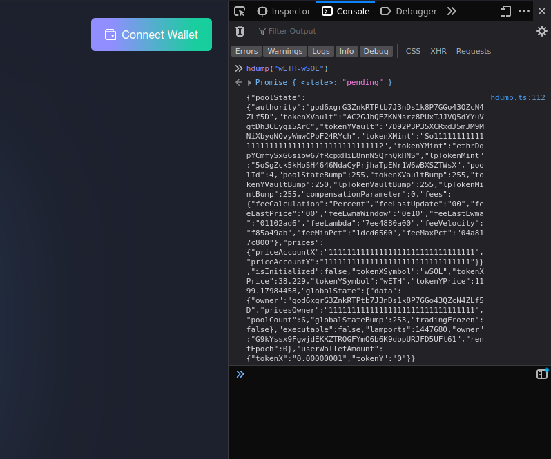

[← 🏠](./CONTRIBUTING.md)

# Manual Testing

Head to our [devnet branch](https://devnet.git.hydraswap.io) here you can test the tip of our development.

### Get some solana

https://solfaucet.com/

Rate limits might be something like Max 2 SOL at a time 5 times a day

### Head to our token faucet

Navigate to the faucets page on devnet:

https://devnet.git.hydraswap.io/#/faucets

Airdrop the tokens you need to test with.

These tokens are the ones our system has been whitelisted to work with.

## First time init

The following has likely already been done on deployment but incase here are some initialization that is required for deploying a fresh set of pools:

### Initialize global state

If the contracts have just been deployed to fresh keys, creation of pools will be frozen until the deployer address (hard coded into the contract as deployed) runs the following command.

```
$ yarn hydra lp initialize-global-state
```

### Add a prices owner

When working with an hmm pool we can add a prices owner as a guard against bad pyth oracles

(This could potentially be merged with initialize-global-state)

```
$ yarn hydra lp set-global-owner vnfiDNmvcgz5vyjzGVQbP7A7xQ2yXwjYsaUu2ishBbZn
```

## Create a pool

Pools need to be initialized using the CLI

```
hydra lp initialize --network devnet \
  --tokenXMint 7xQ2yXwjYsaUu2ishBbZnvnfiDNmvcgz5vyjzGVQbP7A \
  --tokenYMint E9L3jFs1qqTtxvCzgm6gTdpHMwkmhbbSzGR6gfav7Peq \
  --priceAccountX HovQMDrbAgAYPCmHVSrezcSmkMtXSSUsLDFANExrZh2J \
  --priceAccountY EdVCmQ9FSPcVe5YySXDPCRmc8aDQLKJ9xvYBMZPie1Vw \
  --cValue 125
```

### Connect cli to a ledger device

TBC

## Deposit liquidity

You should now use the interface get some tokens from the faucets and add liquidity.

## Reporting errors with pool operations

In order to fix errors we need them reported so that we have all the information we need to reproduce them. Because of this we have a console function for dumping the state of a pool we can use when we are having trouble swapping or adding liquidity.

### hdump() console function

To use the console function do the following:

1. open the [devtools console](https://elfsight.com/blog/2020/07/how-to-work-with-developer-console/) in your browser
2. Navigate to the [pools page](https://devnet.git.hydraswap.io/#/pools) and take note of the name of the pool you are interested in
3. Type the following to dump the state of that pool and hit enter:

   ```
   hdump("wETH-wSOL");
   ```

   You should see output that looks something like this:

   

4. Double click to copy the JSON info and paste it to the issue - this information will help our developers identify the issue you are having and reproduce the issue.

## Testing process

1. Before running a manual test `hdump(x)` the pool you want to test and include it within the test report.
1. Take note of every interaction you do and write a list of steps the developer can follow to reproduce the bug

---

## Example Bug Report

1. starting with the hdump below
1. navigate to `/#/swap`
1. setup a swap with USDC:1,000 and wETH:10
1. click Approve
1. click Confirm Swap
1. Would expect wallet dialog to show the approve button but instead we see `Transaction Expired` (see screenshot)

```
{"poolState":{"authority":"5tZbDCfLmDuZmKT2mhMwJNi2W52zZb3aEzt7sNjLYuva","tokenXVault":"BmkVtqorQX6woZcC3wegL652yiQwHgUr2knWVZMtgTMX","tokenYVault":"EzE3u4xPjvYt3y5XW7zWAMVGmid58qN3NajN91CZeVFM","tokenXMint":"CaTBg374bRTxCQoL6QKzypLDZxDX5CNyEgSKLTQ3Pdvz","tokenYMint":"F8CZTM8fMtyabXvbkgZQSySGtaSD74uzC8wpWqMUTBY7","lpTokenMint":"89mU9NnrARGFv2enqRKyQxec1AKDfjP3yQK2kY1peJG3","poolId":0,"poolStateBump":254,"tokenXVaultBump":253,"tokenYVaultBump":254,"lpTokenVaultBump":255,"lpTokenMintBump":254,"cValue":125,"fees":{"feeCalculation":"Percent","feeLastUpdate":"00","feeLastPrice":"00","feeEwmaWindow":"0e10","feeLastEwma":"00","feeLambda":"7ee4880a00","feeVelocity":"f85a49ab","feeMinPct":"1dcd6500","feeMaxPct":"04a817c800"},"prices":{"priceAccountX":"5SSkXsEKQepHHAewytPVwdej4epN1nxgLVM84L4KXgy7","priceAccountY":"HovQMDrbAgAYPCmHVSrezcSmkMtXSSUsLDFANExrZh2J"}},"tokenXVault":{"pubkey":"BmkVtqorQX6woZcC3wegL652yiQwHgUr2knWVZMtgTMX","account":{"lamports":2039280,"data":{"mint":"CaTBg374bRTxCQoL6QKzypLDZxDX5CNyEgSKLTQ3Pdvz","owner":"D3hBfHEBL4ycxPY3Vrr6kX5trqdCggre95SUpC7enHLn","amount":"1020201000000n","delegateOption":0,"delegate":"11111111111111111111111111111111","state":1,"isNativeOption":0,"isNative":"0n","delegatedAmount":"0n","closeAuthorityOption":0,"closeAuthority":"11111111111111111111111111111111"},"owner":"TokenkegQfeZyiNwAJbNbGKPFXCWuBvf9Ss623VQ5DA","executable":false,"rentEpoch":359}},"tokenYVault":{"pubkey":"EzE3u4xPjvYt3y5XW7zWAMVGmid58qN3NajN91CZeVFM","account":{"lamports":2039280,"data":{"mint":"F8CZTM8fMtyabXvbkgZQSySGtaSD74uzC8wpWqMUTBY7","owner":"D3hBfHEBL4ycxPY3Vrr6kX5trqdCggre95SUpC7enHLn","amount":"980208708n","delegateOption":0,"delegate":"11111111111111111111111111111111","state":1,"isNativeOption":0,"isNative":"0n","delegatedAmount":"0n","closeAuthorityOption":0,"closeAuthority":"11111111111111111111111111111111"},"owner":"TokenkegQfeZyiNwAJbNbGKPFXCWuBvf9Ss623VQ5DA","executable":false,"rentEpoch":359}},"tokenXMint":{"account":{"data":{"mintAuthorityOption":1,"mintAuthority":"JAUuM8gbgyHWUsM3fNPD27MvQrvzXQjwkgjVsZbQLkFF","supply":"7000000000000n","decimals":9,"isInitialized":true,"freezeAuthorityOption":1,"freezeAuthority":"JAUuM8gbgyHWUsM3fNPD27MvQrvzXQjwkgjVsZbQLkFF"},"executable":false,"lamports":1461600,"owner":"TokenkegQfeZyiNwAJbNbGKPFXCWuBvf9Ss623VQ5DA","rentEpoch":358},"pubkey":"CaTBg374bRTxCQoL6QKzypLDZxDX5CNyEgSKLTQ3Pdvz"},"tokenYMint":{"account":{"data":{"mintAuthorityOption":1,"mintAuthority":"8JRQub7zPoqgadNyb7XJyNSkmrJxqy3F93pxqmS29izf","supply":"6000000000000n","decimals":9,"isInitialized":true,"freezeAuthorityOption":1,"freezeAuthority":"8JRQub7zPoqgadNyb7XJyNSkmrJxqy3F93pxqmS29izf"},"executable":false,"lamports":1461600,"owner":"TokenkegQfeZyiNwAJbNbGKPFXCWuBvf9Ss623VQ5DA","rentEpoch":358},"pubkey":"F8CZTM8fMtyabXvbkgZQSySGtaSD74uzC8wpWqMUTBY7"},"lpTokenMint":{"pubkey":"89mU9NnrARGFv2enqRKyQxec1AKDfjP3yQK2kY1peJG3","account":{"lamports":1461600,"data":{"mintAuthorityOption":1,"mintAuthority":"D3hBfHEBL4ycxPY3Vrr6kX5trqdCggre95SUpC7enHLn","supply":"31622776601n","decimals":9,"isInitialized":true,"freezeAuthorityOption":0,"freezeAuthority":"11111111111111111111111111111111"},"owner":"TokenkegQfeZyiNwAJbNbGKPFXCWuBvf9Ss623VQ5DA","executable":false,"rentEpoch":359}},"isInitialized":true,"tokenYPrice":24002.73112501,"globalState":{"data":{"owner":"5tZbDCfLmDuZmKT2mhMwJNi2W52zZb3aEzt7sNjLYuva","pricesOwner":"gSbePebfvPy7tRqimPoVecS2UsBvYv46ynrzWocc92s","poolCount":6,"globalStateBump":253,"tradingFrozen":false},"executable":false,"lamports":1447680,"owner":"G9kYssx9FgwjdEKKZTRQGFYmQ6b6K9dopURJFD5UFt61","rentEpoch":358},"tokenXSymbol":"USDC","tokenYSymbol":"wBTC"}
```
